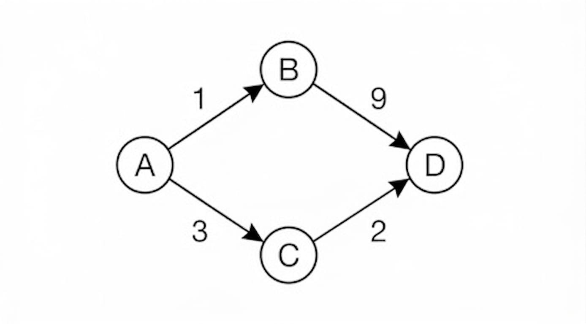

# Directed Weighted Graphs



- TOC
{:toc}

### [Network Delay Time](https://leetcode.com/problems/network-delay-time/)

> Effectively, there are N network nodes, labelled 1 to N. 
> Starting from K, find maximum time a signal reaches all N nodes. 
> Even though the ask is to find the max time, this distills down to find the
> shortest distance from node K to all nodes.

<details><summary markdown="span">Using Dijkstra! - O(N+ElogN)</summary>

```python
class Solution:
    def networkDelayTime(self, times: List[List[int]], n: int, k: int) -> int:
        nodes = set([x[0] for x in times] + [x[1] for x in times])
        graph = collections.defaultdict(list)
        for u, v, w in times:
            graph[u].append((w, v))

        visited = collections.defaultdict(int)
        heap = [(0, k)]
        while heap:
            dist, curr = heapq.heappop(heap)
            visited[curr] = dist

            if len(visited) == n:
                break

            for weight, neighbor in graph[curr]:
                if neighbor not in visited:
                    heapq.heappush(heap, (dist + weight, neighbor))

        if len(visited) != n:
            return -1   # could indicate a negative weight Cycle
        else:
            return max(visited.values())
```
</details>
<BR>

<details><summary markdown="span">Using Bellman Ford. O(N.E)</summary>

```python
class Solution:
    def networkDelayTime(self, times: List[List[int]], n: int, k: int) -> int:
        # Setup
        nodes = set([x[0] for x in times] + [x[1] for x in times])
        if len(nodes) < n:
            return -1

        # Core Algorithm
        g = {x: float('inf') for x in nodes}
        g[k] = 0
        for _ in range(n):
            for u, v, w in times:
                g[v] = min(g[v], g[u] + w)

        # Negative Weight Cycle Detection
        if g[v] < 0:
            return -1

        # Result
        if max(g.values()) < float('inf'):
            return max(g.values())
        else:
            return -1           
```
</details>
<BR>

<details><summary markdown="span">Using Floyd Warshall. O(N.N.N) Can also be used to get tree-diameter, see below </summary>

```python
class Solution:
    def networkDelayTime(self, times: List[List[int]], n: int, k: int) -> int:
        # Setup
        nodes = set([x[0] for x in times] + [x[1] for x in times])
        if len(nodes) < n:
            return -1

        # Core Algorithm starts
        g = {x: {x: float('inf') for x in nodes} for x in nodes}
        for u,v,w in times:
            g[u][u]=g[v][v]=0
            g[u][v]=w
            
        for i in nodes:
            for u in nodes:
                for v in nodes:
                    g[u][v] = min(g[u][v], g[u][i] + g[i][v])
        # Core Algorithm ends

        # Negative Weight Cycle Detection
        if g[u][u] < 0:
            return -1

        # Result
        if max(g[k].values()) == float('inf'):
            return -1
        else:
            return max(g[k].values())
```
</details>
<BR>

<details><summary markdown="span">Using DFS - O(2^V)</summary>
    
This isn't technically backtracking. Instead, you use that value as a global state to prune branches. If you reach a node and your current travel time is already worse than the best time recorded, you stop. This is more accurately called Branch and Bound.
```python
class Solution:
    def networkDelayTime(self, times: list[list[int]], n: int, k: int) -> int:
        def solve(curr, currDist):
            # Only proceed if we found a strictly better (shorter) path
            if currDist < visited[curr]:
                visited[curr] = currDist
                for weight, neighbor in graph[curr]:
                    solve(neighbor, currDist + weight)

        nodes = set([x[0] for x in times] + [x[1] for x in times])
        graph = collections.defaultdict(list)
        for u, v, w in times:
            graph[u].append((w, v))
            
        visited = collections.defaultdict(lambda: float('inf'))        
        solve(k, 0)
        if len(visited) == n:
            return max(visited.values())
        return -1
```
</details>
<BR>


### [Connecting Cities at Minimum cost](https://leetcode.com/problems/connecting-cities-with-minimum-cost/)
Return the minimum cost to connect all n nodes such that there is at least one path between each pair of cities. 

<details><summary markdown="span">Using Prim's algorithm</summary>

```python
class Solution:
    def minimumCost(self, n: int, connections: List[List[int]]) -> int:
        # 1. Build the graph (undirected for cities)
        graph = collections.defaultdict(list)
        for u, v, w in connections:
            graph[u].append((w, v))
            graph[v].append((w, u))

        visited = set()
        # heap stores (edge_weight, current_node)
        # We can start from any node, e.g., node 1
        heap = [(0, 1)]
        total_cost = 0
        
        while heap:
            cost, curr = heapq.heappop(heap)
            
            if curr in visited:
                continue
                
            # Add to MST
            visited.add(curr)
            total_cost += cost
            
            # If we've connected all cities, we're done
            if len(visited) == n:
                return total_cost

            for weight, neighbor in graph[curr]:
                if neighbor not in visited:
                    heapq.heappush(heap, (weight, neighbor))

        # If the loop finishes and we haven't visited n nodes, it's disconnected
        return total_cost if len(visited) == n else -1
```
</details>
<BR>


### [Tree Diameter](https://leetcode.com/problems/tree-diameter/)
> Given an undirected tree, return its bottomUp: the number of edges in a longest path in that tree.
> Note: This is unlike [shortest-(repeatable)-path-visiting-all-nodes](https://leetcode.com/problems/shortest-path-visiting-all-nodes/)
> in that, the path cannot have repeated edges 

<details><summary markdown="span">Using Floyd Warshall!</summary>

```python
class Solution:
    def treeDiameter(self, times: List[List[int]]) -> int:
        nodes = set([x[0] for x in times] + [x[1] for x in times])
        g = {x: {x: float('inf') for x in nodes} for x in nodes}
        for a, b in times:
            g[a][b] = g[b][a] = 1
            g[a][a] = g[b][b] = 1

        maxVal = -1
        for i in nodes:
            for a in nodes:
                for b in nodes:
                    g[a][b] = min(g[a][b], g[a][i] + g[i][b])
                    if g[a][b] != float('inf'):
                        maxVal = max(maxVal, g[a][b])

        return maxVal

```
</details>
<BR>

<details><summary markdown="span">Using Dijkstra</summary>

```python
class Solution:
    def treeDiameter(self, edges: List[List[int]]) -> int:
        graph = collections.defaultdict(set)
        for a, b in edges:
            graph[a].add(b)
            graph[b].add(a)

        startingNodes = [u for u, v in graph.items() if len(v) == 1]
        maxCount = -1
        for startNode in startingNodes:
            q = [ (startNode,0)]
            visited = set()
            while q:
                currNode, currCount = q.pop(0)
                maxCount = max(maxCount, currCount)
                visited.add(currNode)
                for neighbor in graph[currNode] - visited:
                    q.append((neighbor, currCount+1))

        return maxCount
```

</details>
<BR>

## [Key Intuitions](https://en.wikipedia.org/wiki/Dijkstra%27s_algorithm)


Summary:
* Dijkstra says: "I'm going this way, it looks cheap!"
* Bellman-Ford says: "I'll check every road $N$ times just to be safe."
* Floyd-Warshall says: "I'll try every single city as a layover for every other city."

<details><summary markdown="span">Sortest path from A->D (Djikstra) </summary> <BR>

Dijkstra uses a Priority Queue to always explore the "closest" node to the start (A) first. Here is the play-by-play:
Step 1: Start at A

*   Distance map: `{A: 0, B: ∞, C: ∞, D: ∞}`
*   Dijkstra looks at A's neighbors: B (cost 1) and C (cost 3).
*   Priority Queue (PQ): `[(1, B), (3, C)]`

Step 2: Visit B (The Greedy Choice)

*   Dijkstra pops B because it has the smallest distance (1).
*   It looks at B's neighbors: D.
*   The path to D through B is 1 + 9 = 10.
*   Distance map: `{A: 0, B: 1, C: 3, D: 10}`
*   PQ: `[(3, C), (10, D)]`
*   Note: Even though we "found" D, we haven't "finalized" it yet because there are smaller values in the queue.

Step 3: Visit C

*   Dijkstra pops C because 3 is smaller than 10.
*   It looks at C's neighbors: D.
*   The path to D through C is 3 + 2 = 5.
*   Check: Is 5 better than our current distance to D (10)? Yes.
*   Distance map: `{A: 0, B: 1, C: 3, D: 5}`
*   PQ: `[(5, D), (10, D)]` (The 10 is still there but will be ignored later).

Step 4: Finalize D

*   Dijkstra pops D with the value 5.
*   Since D is the destination, we are done!

Summary of the Shortest Path
Even though the path A → B looked better initially (weight 1 vs weight 3), Dijkstra eventually finds that the path A → C → D is the winner with a total weight of 5.

Why this is different from Prim's

If this were Prim's Algorithm, the very first thing it would do is pick edge A-B (1). Then, it would look at the available edges from {A, B} and pick C-A (3) because 3 is smaller than 9. Finally, it would pick D-C (2).

*   Prim's result (MST): A-B, A-C, C-D (Total weight: 6).
*   Dijkstra's result (Shortest Path): A-C, C-D (Total weight: 5).
*   
</details>
<BR>


<details><summary markdown="span">Shortest path from A->D (Bellman Ford-DP) </summary> <BR>

At the very start (Step 0), only the source is known. All others are "infinite."
`[A: 0, B: inf, C: inf, D: inf]`

  Iteration 1: Finding paths with 1 edge

We look at every edge in our list.

Process `(A, B)` weight 1: 0 + 1 is less than inf.
State: `[A: 0, B: 1, C: inf, D: inf]`

Process `(A, C)` weight 3: 0 + 3 is less than inf.
State: `[A: 0, B: 1, C: 3, D: inf]`

Process `(B, D)` weight 9: 1 + 9 is less than inf.
State: `[A: 0, B: 1, C: 3, D: 10]`

Process `(C, D)` weight 2: 3 + 2 is less than 10.
State: `[A: 0, B: 1, C: 3, D: 5]`

**End of Iteration 1 state:** `[A: 0, B: 1, C: 3, D: 5]`

</details>
<BR>


<details><summary markdown="span">Shortest path from A->D (Floyd Warshall) </summary> <BR>

While Dijkstra and Bellman-Ford look for the shortest path from one source, Floyd-Warshall finds the shortest path between every possible pair of nodes simultaneously.

The intuition here isn't about "rippling" out from a start point; it's about systematically testing shortcuts.

The Intuition: "The Middle-Man": Imagine you have a map of cities. Initially, you only know the direct flights between them. Floyd-Warshall asks a simple question for every pair of cities $(i, j)$:

"Is it faster to go directly from i to j, or is it faster to stop at city k in between?"

</details>
<BR>


