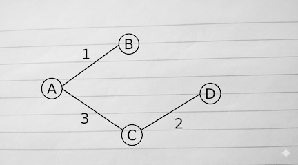

{: .no_toc}
# Undirected Graphs  (Weighted)


- TOC
{:toc}

### [Path with maximal probability](https://leetcode.com/problems/path-with-maximum-probability/description/)

> Given two nodes start and end, find the path with the maximum probability of success to go from start to end and return its success probability.

<details><summary markdown="span">Execute!</summary>

```python
class Solution:
    def maxProbability(self, n: int, edges: list[list[int]], succProb: list[float], start_node: int, end_node: int) -> float:
        graph = defaultdict(set) 
        for (u, v), p in zip(edges, succProb):
            graph[u].add((p, v)); graph[v].add((p, u))

        visited = {} 
        heap = [(-1.0, start_node)]
        
        while heap:
            p, curr = heapq.heappop(heap)
            p = -p
               
            visited[curr] = p            
            if curr == end_node:
                break
                
            for weight, neighbor in graph[curr]:
                if neighbor not in visited:
                    heapq.heappush(heap, (-(p * weight), neighbor))
                    
        return visited.get(end_node, 0.0)
```

</details>
<BR>


### [Connecting Cities at Minimum cost](https://leetcode.com/problems/connecting-cities-with-minimum-cost/)
Return the minimum cost to connect all n nodes such that there is at least one path between each pair of cities. 

<details><summary markdown="span">Using Prim's algorithm</summary>

The fundamental difference between Dijkstra’s Algorithm (for shortest paths) and Prim’s Algorithm (for Minimum Spanning Trees) is how they prioritize the "next" node to visit. In Dijkstra's, you care about the total distance from the start. In Prim's, you only care about the cost of the immediate bridge to an unvisited node.

Using the original example, Prims would render



```python
class Solution:
    def minimumCost(self, n: int, connections: List[List[int]]) -> int:        
        graph = collections.defaultdict(list)        
        for u, v, w in connections:
            graph[u].append((w, v))
            graph[v].append((w, u))

        # Visited will inevitably become a Minimum Spanning Tree
        visited = collections.defaultdict(int)
        k = 1 # Starting arbitrarily with node k, find the shortest path
        heap = [(0, k)]        
        while heap:
            cost, curr = heapq.heappop(heap)            
            if curr in visited:
                continue

            visited[curr] += cost
            if len(visited) == n:
                break
            for weight, neighbor in graph[curr]:
                if neighbor not in visited:
                    heapq.heappush(heap, (weight, neighbor)) # Different from Djikstra

        return sum(visited.values()) if len(visited) == n else -1
```
</details>
<BR>
