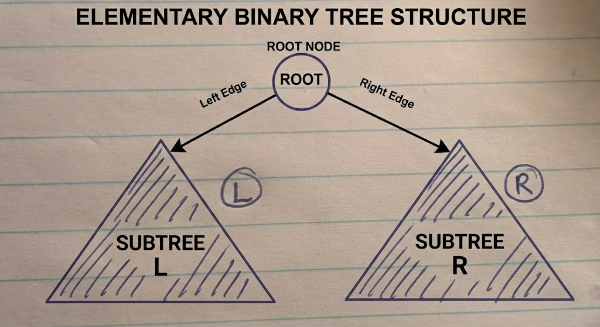

{: .no_toc}
# Binary Trees



- TOC
{:toc}

### [Lowest Common Ancestor](https://leetcode.com/problems/lowest-common-ancestor-of-a-binary-tree/)

> Given a binary tree, find the lowest common ancestor (LCA) of two given nodes in the tree.

<details><summary markdown="span">Execute!</summary>

```python
class Solution(object):
    def lowestCommonAncestor(self, root, p, q):
        if not root:
            return None
        elif p == root or q == root:
            return root
        else:
            left  = self.lowestCommonAncestor(root.left,  p , q)
            right = self.lowestCommonAncestor(root.right, p , q)

            if left and right:
                return root
            elif not left:
                return right
            elif not right:
                return left
```

</details>
<BR>

### [Flip Equivalent Binary Trees](https://leetcode.com/problems/flip-equivalent-binary-trees/)

> Evaluate if a binary tree X is flip equivalent to a binary tree Y - i.e. if we can make X equal
to Y after some number of flip operations. 

<details><summary markdown="span">Execute!</summary>

```python
class Solution(object):
    def flipEquiv(self, a, b):
        if a == b == None:
            return True
        elif a is None or b is None:
            return False
        elif a.val != b.val:
            return False
        return (self.flipEquiv(a.left, b.left)  and self.flipEquiv(a.right, b.right) or
                self.flipEquiv(a.left, b.right) and self.flipEquiv(a.right, b.left))
```

</details>
<BR>

### [Invert Binary Trees](https://leetcode.com/problems/invert-binary-tree/)

> Invert a binary tree.

<details><summary markdown="span">Execute!</summary>

```python
def invertTree(root):
    if root is not None:
        return TreeNode(root.val, 
                        invertTree(root.right), 
                        invertTree(root.left))

```

</details>
<BR>

### [Merge Two Binary Trees](https://leetcode.com/problems/merge-two-binary-trees/)

> Given two binary trees and imagine that when you put one of them to cover the other, 
some nodes of the two trees are overlapped while the others are not. The merge rule is that if two nodes overlap, 
then sum node values up as the new value of the merged node.

<details><summary markdown="span">Execute!</summary>

```python
class Solution:
    def mergeTrees(self, a: TreeNode, b: TreeNode) -> TreeNode:
        if a is None and b is None:
            return
        if a is None:
            return b
        elif b is None:
            return a
        if a is not None and b is not None:
            return TreeNode(a.val + b.val, self.mergeTrees(a.left, b.left), self.mergeTrees(a.right, b.right))
```

</details>
<BR>


### [Symmetric Trees](https://leetcode.com/problems/symmetric-tree/)

> Given a binary tree, check whether it is a mirror of itself (ie, symmetric around its center).

<details><summary markdown="span">Execute!</summary>

```python
class Solution:
    def isSymmetric(self, root: TreeNode) -> bool:
        def check(a,b):
            if a is None and b is None:
                return True
            if a is None or b is None:
                return False
            if a.val == b.val and check(a.left,b.right) and check(a.right, b.left):
                return True
            else:
                return False

        return check(root,root)
```

</details>
<BR>

