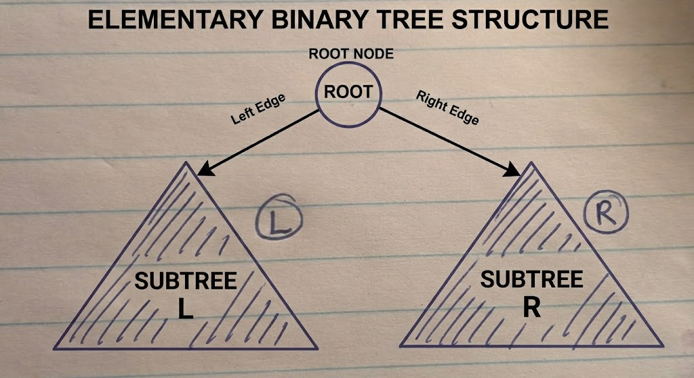

{: .no_toc}
# Binary Trees



Key intuition here: Solving for root node only is simpler - before thinking through how to extend for if path may not be through root node

- TOC
{:toc}

### [Path with Maximum sum](https://leetcode.com/problems/binary-tree-maximum-path-sum/)

> Given a non-empty binary tree, find the maximum path sum

<details><summary markdown="span">Execute!</summary>

```python
class Solution:
    def maxPathSum(self, root: Optional[TreeNode]) -> int:
        def solve(node):
            if not node:
                return 0
            else:
                l = max(solve(node.left), 0)
                r = max(solve(node.right), 0)
                
                # What is the best path that passes through me, connecting my left and right subtrees?"
                self.maxSum = max(self.maxSum, node.val + l + r)

                # If my parent wants to include me in a path, what is the best single branch I can offer them?
                return max(l, r) + node.val

        self.maxSum = float('-inf')
        solve(root)
        return self.maxSum
```

</details>
<BR>

### [Tree Diameter](https://leetcode.com/problems/diameter-of-binary-tree/)

> Calculate Tree Diameter

<details><summary markdown="span">Execute!</summary>

```python
class Solution:
    def diameterOfBinaryTree(self, root: TreeNode, max_d=0) -> int:
        def solve(root):
            if root is None:
                return 0
            else:
                ls = solve(root.left)
                rs = solve(root.right)
                
                self.res = max(self.res, ls + rs)      # Calculates Diameter
                return max(ls, rs) + 1                 # Calculates Depth
        self.res = 0
        solve(root)
        return self.res
```

</details>
<BR>

### [Number of Paths having Sum](https://leetcode.com/problems/path-sum-iii/)

> Given a binary tree in which each node contains an integer value. Find the number of paths that sum to a given value.
> [See also](https://leetcode.com/problems/maximum-size-subarray-sum-equals-k/)

<details><summary markdown="span">Execute!</summary>

```python
class Solution:
    def pathSum(self, root: TreeNode, target: int) -> int:
        def find_paths(root, target):
            if not root:
                return 0

            return int(root.val == target) + find_paths(root.left, target-root.val) + find_paths(root.right, target-root.val)

        if not root:
            return 0

        return find_paths(root, target) + self.pathSum(root.left, target) + self.pathSum(root.right, target)
```

</details>
<BR>

### [Check if tree is Height Balanced](https://leetcode.com/problems/balanced-binary-tree/) 

> Given a binary tree, determine if it is height-balanced - left and right subtrees of every node differ in height by no more than 1.

<details><summary markdown="span">Execute!</summary>

```python
class Solution:
    def isBalanced(self, root: Optional[TreeNode]) -> bool:
        def depth(node):
            if not node:
                return 0
            else:
                ls = depth(node.left)
                rs = depth(node.right)

                if abs(ls - rs) > 1:
                    self.isBalanced = False

                return 1 + max(ls, rs)

        self.isBalanced = True
        depth(root)
        return self.isBalanced
```

</details>
<BR>
